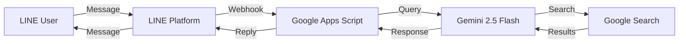

# 🚄 JP-Transit Bot

[](https://opensource.org/licenses/MIT)
[](https://script.google.com/)
[](https://developers.line.biz/)
[](https://ai.google.dev/)

A serverless LINE chatbot that provides real-time Japanese transportation information with bilingual station names (Traditional Chinese/Japanese). Powered by Google Apps Script and Gemini 2.5 Flash with Google Search grounding.

## ✨ Features

- 🔍 **Real-time Transit Data** - Leverages Gemini 2.5 Flash with Google Search for up-to-date train schedules
- 🌐 **Bilingual Station Names** - All stations displayed as "中文 (日文)" for easy navigation
- 💬 **LINE Integration** - Instant queries through familiar LINE messaging interface
- 🛡️ **Robust Error Handling** - Graceful degradation with user-friendly error messages
- 🚀 **Serverless Architecture** - Zero-cost hosting on Google Apps Script
- 📊 **Structured Responses** - Clean, bullet-point formatted transit information

## 📸 Demo

**User Query:**
```
明日 09:00 東京到輕井澤
```

**Bot Response:**
```
【推薦班次】
* 路線名稱：北陸新幹線 - 淺間號 (あさま 605号)
* 出發時間：09:04 從 東京 (東京) 出發
* 抵達時間：10:16 到達 輕井澤 (軽井沢)
* 乘車月台：20-23 號新幹線月台
* 目的地：長野 (長野) 方向
```

## 🏗️ Architecture



**Tech Stack:**
- **Frontend**: LINE Messaging API
- **Backend**: Google Apps Script (JavaScript)
- **AI**: Google Gemini 2.5 Flash API
- **Data Source**: Google Search (real-time grounding)
- **Deployment**: Google Cloud Platform

## 🚀 Quick Start

### Prerequisites

- Google Account
- LINE Developer Account ([Sign up](https://developers.line.biz/console/))
- Gemini API Key ([Get one](https://aistudio.google.com/app/apikey))

### Installation

#### Option 1: Deploy via Google Apps Script Editor

1. **Clone the repository**
   ```bash
   git clone https://github.com/sean1093/jp-transit-bot.git
   ```

2. **Create a new Apps Script project**
   - Visit [Google Apps Script](https://script.google.com/)
   - Click **New Project**
   - Name it "JP-Transit Bot"

3. **Copy the code**
   - Copy contents from `Code.gs` to the editor
   - Create `appsscript.json` and copy its contents

4. **Configure API credentials**
   - Go to **Project Settings** → **Script Properties**
   - Add:
     - `GEMINI_API_KEY`: Your Gemini API key
     - `LINE_CHANNEL_ACCESS_TOKEN`: Your LINE channel access token

5. **Deploy as Web App**
   - Click **Deploy** → **Manage deployments**
   - Edit @HEAD deployment
   - Set **Who has access** to **Anyone**
   - Copy the Web App URL

6. **Configure LINE Webhook**
   - In [LINE Developers Console](https://developers.line.biz/console/)
   - Go to **Messaging API** → **Webhook settings**
   - Paste the Web App URL
   - Enable **Use webhook**
   - Disable **Auto-reply messages**

#### Option 2: Deploy via Clasp (For Developers)

```bash
# Clone and setup
git clone https://github.com/sean1093/jp-transit-bot.git
cd jp-transit-bot

# Install clasp
npm install -g @google/clasp

# Login and push
clasp login
clasp push

# Configure credentials in Apps Script UI
# Then deploy as Web App (see step 5-6 above)
```

## 📖 Usage

1. **Add the bot as a LINE friend** (scan QR code in LINE Developers Console)
2. **Send a query** in natural language:
   - `明天早上9點從東京到輕井澤`
   - `今天下午從新宿到箱根`
   - `後天 14:00 大阪到京都`
3. **Receive instant response** with train details and bilingual station names

## 📁 Project Structure

```
jp-transit-bot/
├── Code.gs              # Main application (webhook, Gemini API, LINE messaging)
├── appsscript.json      # Apps Script manifest (timezone: Asia/Tokyo)
├── .claspignore         # Clasp deployment exclusions
├── .env.example         # Environment variables template
├── .gitignore           # Git exclusions
├── SPEC.md             # Technical specification
└── README.md           # This file
```

### Core Functions

| Function | Description |
|----------|-------------|
| `doPost(e)` | Webhook handler for LINE messages |
| `doGet(e)` | Health check endpoint |
| `getGeminiResponse(text)` | Gemini API integration with Google Search |
| `sendLineMessage(token, text)` | LINE reply message sender |
| `testGemini()` | Local testing function |

## ⚙️ Configuration

### Environment Variables (Script Properties)

| Variable | Description | Example |
|----------|-------------|---------|
| `GEMINI_API_KEY` | Google Gemini API key | `AIza...` |
| `LINE_CHANNEL_ACCESS_TOKEN` | LINE Messaging API token | `eyJh...` |

### Gemini API Settings

```javascript
{
  model: "gemini-2.5-flash",
  temperature: 0.0,           // Factual consistency
  maxOutputTokens: 8192,
  tools: [{ googleSearch: {} }]  // Real-time grounding
}
```

### System Instructions

The bot is configured with strict prompts to ensure:
- Traditional Chinese output only
- Bilingual station format: `中文 (日文)`
- Structured bullet-point responses
- Factual data only (no conversational fluff)

## 📊 API Quotas (Free Tier)

| Limit | Value |
|-------|-------|
| Requests per minute | 15 |
| Requests per day | 1,500 |
| Tokens per minute | 1,000,000 |

**Estimated capacity**: ~1,500 transit queries per day

## 🧪 Testing

### Test Gemini Integration
```javascript
// In Apps Script Editor
// Select testGemini() and click Run
```

### Test Deployment Health
```bash
curl https://script.google.com/macros/s/YOUR_DEPLOYMENT_ID/exec
# Expected: {"status":"ok","message":"JP-Transit Bot is running",...}
```

### Test LINE Integration
1. Add bot as friend via QR code
2. Send test message
3. Check Apps Script **Executions** tab for logs

## 🐛 Troubleshooting

<details>
<summary><b>Webhook Returns 302 Error</b></summary>

- Ensure deployment **"Who has access"** is set to **Anyone**
- Verify URL ends with `/exec`
- Redeploy by editing @HEAD deployment
</details>

<details>
<summary><b>No Response from Bot</b></summary>

- Check **Executions** tab in Apps Script for errors
- Verify Script Properties are set correctly
- Ensure **Use webhook** is enabled in LINE console
- Confirm **Auto-reply messages** is disabled
</details>

<details>
<summary><b>API Quota Exceeded</b></summary>

- Monitor usage at [Google AI Studio](https://aistudio.google.com/)
- Consider upgrading to pay-as-you-go (~$0.30 per 1,000 queries)
- Free tier resets daily at UTC 00:00
</details>

<details>
<summary><b>Wrong Language or Format</b></summary>

- Temperature is set to 0.0 for consistency
- Check `SYSTEM_INSTRUCTION` in [Code.gs:11-28](Code.gs#L11-L28)
- Verify Gemini API is using correct model
</details>

## 🔐 Security

- ✅ **No hardcoded credentials** - All API keys stored in Script Properties
- ✅ **Gitignored secrets** - `.clasp.json` excluded from repository
- ✅ **HTTPS only** - All API calls encrypted
- ✅ **Input validation** - Webhook payload verification
- ✅ **Error isolation** - Individual message processing with try-catch

## 🛠️ Development

### Local Development Workflow

```bash
# 1. Make changes to Code.gs locally
# 2. Push to Apps Script
clasp push

# 3. Test in Apps Script Editor or via LINE
# 4. Commit to Git
git add .
git commit -m "Your message"
git push
```

### Code Quality

- **Linting**: Follow Google Apps Script best practices
- **Error Handling**: Comprehensive try-catch with logging
- **Documentation**: JSDoc comments for all functions
- **Type Safety**: Parameter validation and null checks

## 🤝 Contributing

Contributions are welcome! Please follow these steps:

1. **Fork the repository**
2. **Create a feature branch** (`git checkout -b feature/amazing-feature`)
3. **Commit your changes** (`git commit -m 'Add amazing feature'`)
4. **Push to the branch** (`git push origin feature/amazing-feature`)
5. **Open a Pull Request**

### Development Guidelines

- Maintain code style consistency
- Add tests for new features
- Update documentation
- Follow semantic versioning

## 📝 License

This project is licensed under the MIT License - see the [LICENSE](LICENSE) file for details.

## 🙏 Acknowledgments

- [Google Gemini](https://ai.google.dev/) - AI-powered transit information
- [LINE Messaging API](https://developers.line.biz/) - Chat platform integration
- [Google Apps Script](https://script.google.com/) - Serverless hosting

## 📧 Support

- **Issues**: [GitHub Issues](https://github.com/sean1093/jp-transit-bot/issues)
- **Discussions**: [GitHub Discussions](https://github.com/sean1093/jp-transit-bot/discussions)
- **Documentation**:
  - [LINE API Docs](https://developers.line.biz/en/docs/)
  - [Gemini API Docs](https://ai.google.dev/docs)
  - [Apps Script Docs](https://developers.google.com/apps-script)

## ⭐ Star History

If you find this project useful, please consider giving it a star! ⭐

---

<p align="center">Made with ❤️ for travelers exploring Japan</p>
